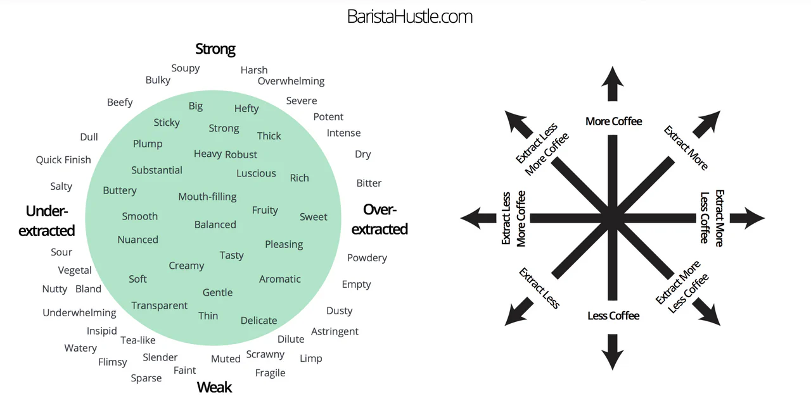

# Cheat Sheat

Espresso has a limited but tightly coupled set of variables. Because each parameter affects the others, the most reliable way to learn is to change only one variable at a time, pull a shot, and evaluate how the flavor, body, and balance shift. This step‑wise method builds intuition and ensures repeatable results.

Most Profiles provide a rough guide where the creator thinks it tastes best. Try to get somewhere in that area and see what you want to change.  
  
Here is what I would focus on and in what order:

1. Set temp to a fitting start for the roast. Usually 88℃ dark, 91℃ medium, 93℃ light. The Profile creator sometimes suggests other values
2. Adjust the grind size based on time and get in the rough ballpark of the profile suggested time.

After that I would focus on taste and let it guide you:

- To Bitter (dry..)?
    - If way to bitter: grind coarser
    - Alternatively: reduce dose
    - If only a bit to bitter: decrease yield
    - Lower Temp a bit
- To sour (salty…)?
    - If Way to sour: grind finer
    - Alternatively: increase dose
    - If only a bit to sour: increase yield
    - Increase Temp a bit
- Not sweet/heavy/concentrated enough or too weak?
    - Decrease yield to get a higher ratio
    - Alternatively increase temp

Practical workflow

1. Identify the dominant flaw (bitterness, sourness, lack of body).
2. Apply (an) adjustment (coarser/finer grind, dose change, yield change, or temperature tweak).
3. Pull a shot and taste.
4. Iterate, changing only one variable at a time to build clear cause‑and‑effect understanding.

Two Guides from Baristahustle that I think are helpfull.

