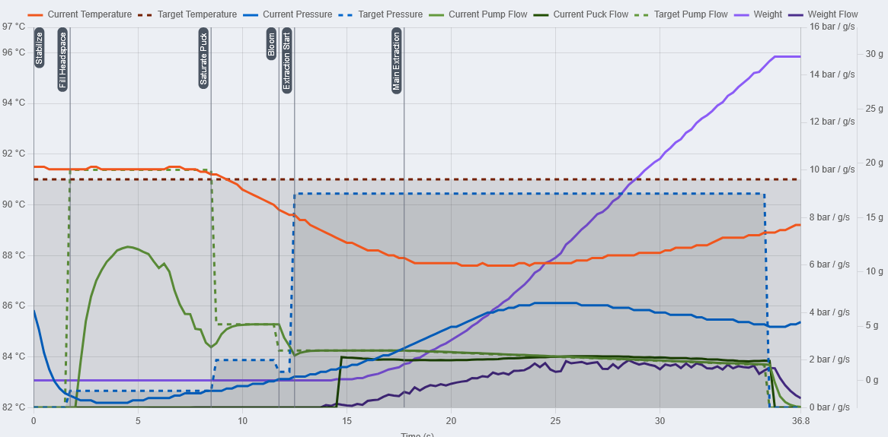
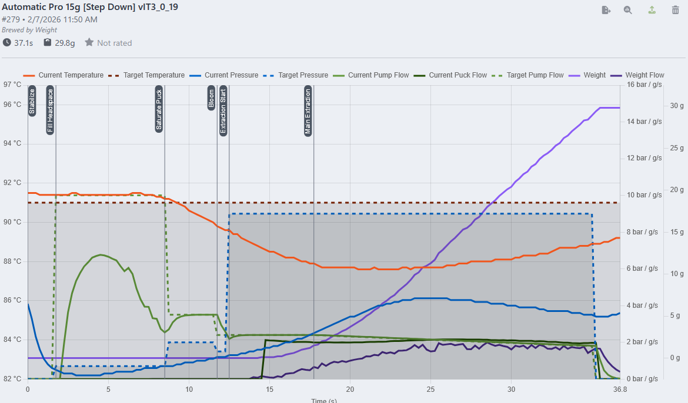
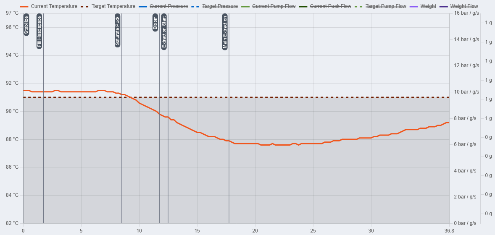
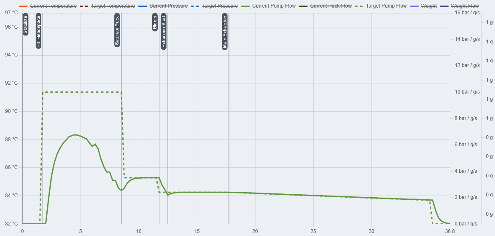
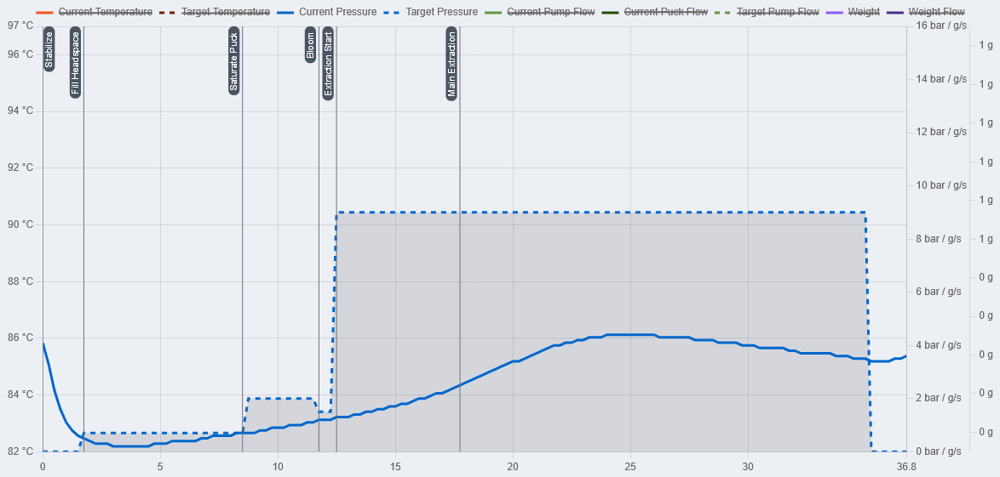
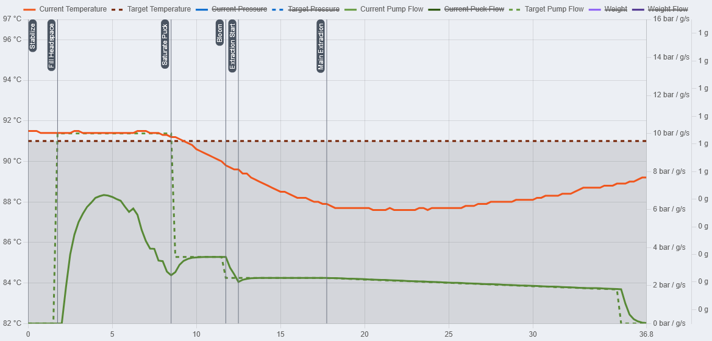
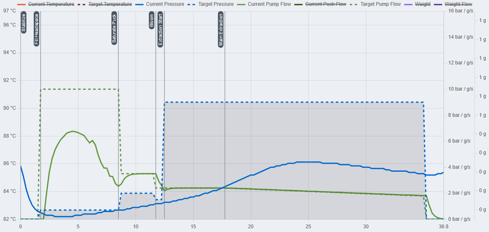
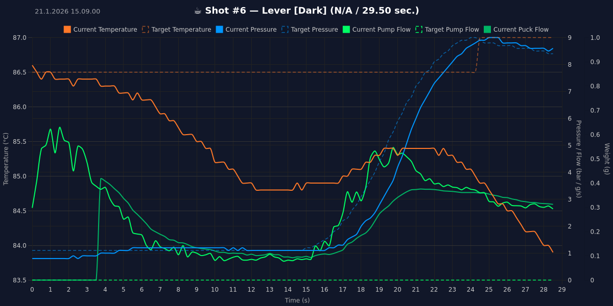

**todo**

The Gaggimate Graphs in the shothistory tap look more complex then they realy are. The visible complexity comes from the fact, that multiple graphs get layered upon each other. But as soon as we disect the graphs and look at the single lines they get way easier to read.

# The Lables
First lets view at the different parts around the graph itself.

At the top there is the legend. We can clearly see what color represents what variable in the graph.

Because of the amount of variables the y-axis gets split into left and right. The left labels of the y-axis displays the temp values (°C) of the graph.

The right side labels of the y-axis are for the pressure(bar), flow(g/s) and weight(g) if a scale is connected.

Inside the Graph there are multiple vertical lines with Lables. They are the phase lables.

The x-axis is for the time dimension(s).

# The Graph

Now lets look at the graph itself and its different lines.

We have a few main values as solid lines: Temperature, Pressure, PumpFlow, PuckFlow, Weight, WeightFlow.

For some values the targets get displayed as dotted lines: Target Temp, Target Flow, Target Pressure.

# How to read a graph.

If we read a graph we move from left to right in the time dimension. This way we can see how a value changed over time.

# Excample Disecting a Shot based on the Graph 

Here is a shot I pulled with a Testversion of the Automatic Pro profile. 

I will first focus on the main variables of Temp, Flow, Pressure and Weight. Afterwards I will compare some to each other and see how they interact with each other.

## Temp

We can see that the Temp changed a bit over the duration of the shot. The Temp was stable for the first 8 Seconds but then started to dip till the lowest point at around 22s of 87.5°C. 

## Flow

This is the first time we can see a Value and its target in comparison. The dotted line shows the target/limit value. We can see that the Flow went up in Fill Headspace to around 7g/s. Afterwards it went down untill the Saturate phase. Afterwards it stayed mostly at the target value.

## Pressure

We can see, that the Pressure was over target in the Stabalize phase (Thats not optimal, I should have let out some Pressure before starting the shot). Afterwards it went down fast and then slowly climbed back up till 4 bar. and started to go down again.

## Temperature and Flow

This is the first time we look at two different lines and how they interact with each other.
Pump Flow means, how much water gets pumped by the pump. This Water needs to get somewhere and that place is the boiler. That incoming cold water will cool down the boiler. The PID will try to counter act this incoming temperature change and heat the water back up. If more water comes in at once, the dip will be deeper and the heater will have a harder time to work against it. 

If we now look at the Graph we can see that we had the biggest flow at around 5s ion the FillHeadspace phase. But the Temperature stayed the same. That has to do with the fact, that the Boiler has alot of thermal pass. The incoming water first has to work against this thermal mass, before the TC can messure it and the PID to react to it. The thermalmass delays the impact in the graph.

After the flow got lower and the PID had the chance to react, the Temperature started to clib again. If we had a higher flow, the temperature could have gone down further and maybe the heater couldnt have worked against it.

## Flow and Pressure

Flow and Pressure are two Variables that are tightly linked. But another Variable is missing: Puckresistance.
Pressure is the combination of Flow and Puckresistance. With alot of Puckresistance little Flow is needed to build Pressure. With less Puckresistance more Flow is needed

We can kind of ignore the Fill Headspace phase for this. The Headspace is mostly air. Pushing water into the headspace has to displace the air first. Air can pass through the puck more easily and will not build much pressure. Afterwards we can see that as the Flow keeps going the Pressure keeps building slowly. This process is relatively slow, because the flow was relatively low (2g/s) and the puck did not give enough resistance for more pressure. The pressure kept increasing because water more water was pushed by the pump then the puck let through. That was true till the 25s mark. There two things happend: The Flow kept decreasing, resulting in slower pressure buildup and the puck resistance decreased. This happens because the puck degrades over time while we extract.

*Assumption based on the graph:*
One thing we can see is, that the thing that limited this extraction in the main phases was the flow. The pressure kept beeing relatively low. That means, that the Puckresistance wasnt high enough to build pressure. We could now grind finer or increase the dose to increase the puck resistance and get more pressure.

THIS IS ONLY A ASSUMPTION! Based on the graph alone we dont know how the cup tasted and if this is realy needed. I cant stress enough how important it is to taste first and only then decide if we want to change something.

This combination in the Graph leads to think that the shot was tasting to sour and wasnt great. Based on the graph alone the decision to grind finer could have been a good thing. But as I am the one who tasted the Cup I can tell you that this would have been the wrong decision in this case. It was a ligher roast where I wanted to highlight slight acidity and fruity notes. In the end the cup was perfect and I did not change anything. This is to show, that the graph can be missleasind if taste isnt used as a important factor.

# More Examples in a bit less detail

## First Example

*This text is copied from a reply I made on Discord a while ago.*

Temp:
The Temp graph is the red one. At the start of the extraction the target value was 86.5. Your machine was spot on. The temp dropped to 85. The drop looks massive in the graph but isnt realy a big deal. on my silvia i get a drop of 8°. So dont worry about temp drop. The only interesting thing is that you had 86.5 at the start. Most likely you had 86.5 throughout the whole shot at the puck.

Flow:
This represents how much water the pump was moving. if you look at the graph, it moved alot of whater at the beginning. around 5g/s and then started to slow down. Normaly the flow is very high at the beginning of a shot. thats to fill the headspace before the puck. after that is filled the pressure will increase because now the water fights the puck instead of displacing air. THats exactly what we see here. After around 3 seconds the flow decreases. Flow and pressure are tightly corelated and directly impact eachother. In this shot the flow got reduced to not increase the pressure to more that was needed. Most likely a preinfusion style in the beginning. 
The idea is to use a lower flow and pressure in the beginning to fully saturate your grounds. This will make it easier to extract the flavor.
After 15s the flow increased to increase the pressure.

Pressure: 
The target of the pressure was around 1bar. GM started with high flow until the headspace was filled and pressure could be build. Filling the headspace took around 3-4s. Afterwards the pressure increased. GM didnt need to pump so much water anylonger because the puck created backpressure. the pressure around 1bar was nicely holded until 15s. Afterwards the pressure target ramped up to 9 bar. Your GM followed the target nicely. It lagged around 1s behind. Thats totaly normal. It sees, that the target is higher then the current value, says pump to pump more water (flowincrease) and after the flow increased the pressure increased as well. The Pressure target went up to 9 bar, and your line followed. The target of 9 bar was reached without any problems. Afterwards the pressuretarget was slowly decreased, and your GM started to decrease flow so your pressure would also decrease.

After 29s your shot finished.

Now I dont know the specific targets of this profile. Normaly Leverstyle shots aim for a longer extraction and less flow. If the target was 30s, you did very well regarding that target and it would get down to taste to decide what to change. If the time target would have been longer, i would grind finer. That way less flow is needed to reach the same pressure. Cremina for example aims for a total shottime of 45 - 55s.
Damians lever on the other hand is Abit over 30s.

But all those targets are dependend on taste.

If the espresso is way to sour or bitter change grindsize.

If its not far of change the yield. higher yield reduces sourness but can increase bitterness.

The Temp I usualy change based on roast and only do tiny adjustments afterwards. if needed.

And if it did taste good, dont change a thing